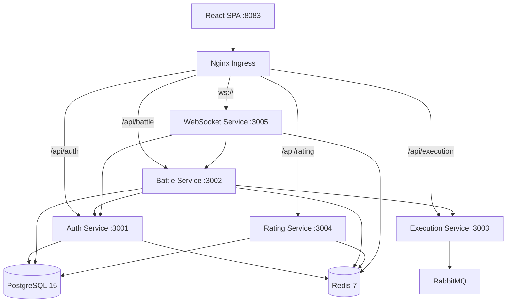

# Architecture

## System Overview

CodeArena is a microservices system with 5 backend services, a React SPA frontend, and supporting infrastructure (PostgreSQL, Redis, RabbitMQ). Each service owns a single domain and communicates via REST APIs or message queues.



## Request Lifecycle

### User starts a battle:
1. Frontend sends `POST /api/battle/create` with JWT
2. Battle service validates token by calling Auth service
3. Battle service creates a battle record in PostgreSQL, publishes to Redis pub/sub
4. WebSocket service picks up the event, notifies matched players via Socket.IO
5. Players submit code → `POST /api/execution/run`
6. Execution service queues the job via RabbitMQ
7. Worker picks it up, runs code in a sandboxed environment (10s timeout, 256MB memory)
8. Result published back through RabbitMQ → Battle service updates scores
9. Rating service recalculates ELO ratings
10. WebSocket pushes live results to both players

### Auth flow:
1. `POST /api/auth/register` — creates user, hashes password (bcrypt), returns JWT
2. `POST /api/auth/login` — validates credentials, returns JWT (7-day expiry)
3. All subsequent requests include `Authorization: Bearer <token>`
4. Auth service exposes `/api/auth/verify` for internal service-to-service token validation

## Technology Choices

| Choice | Alternative Considered | Why We Chose This |
|--------|----------------------|-------------------|
| PostgreSQL | MongoDB | ACID guarantees for battle results, ratings need transactional integrity. ELO calculations involve read-modify-write that requires isolation. |
| Redis | Memcached | Needed pub/sub for real-time event distribution across WebSocket replicas. Memcached doesn't support pub/sub. |
| RabbitMQ | Direct HTTP | Code execution is CPU-intensive (2-10s per run). Queue decouples submission from execution, prevents timeouts, enables worker scaling. |
| Socket.IO | Raw WebSockets | Automatic reconnection, room-based broadcasting, and fallback to long-polling. Battle rooms map directly to Socket.IO rooms. |
| Express | Fastify | Team familiarity. Express middleware ecosystem is more mature for JWT/CORS patterns we needed. Fastify would've been ~15% faster but not worth migration cost. |
| Vite | Create React App | CRA is effectively deprecated. Vite HMR is sub-100ms vs CRA's 2-3s. No contest. |

## Service Ownership

Each service owns specific database tables. No service directly queries another service's tables.

| Service | Owns | Dependencies |
|---------|------|-------------|
| auth-service | `users`, `refresh_tokens` | PostgreSQL, Redis |
| battle-service | `battles`, `battle_participants`, `submissions` | PostgreSQL, Redis, RabbitMQ, auth-service, execution-service |
| execution-service | None (stateless) | RabbitMQ |
| rating-service | `ratings`, `rating_history` | PostgreSQL, Redis |
| websocket-service | None (stateless) | Redis (pub/sub), auth-service, battle-service |

## Scaling Strategy

### Current (Minikube — development)
- 1 replica per service, 1 PostgreSQL pod, 1 Redis pod
- 4 CPU / 8GB RAM node

### Production (AWS EKS)
- **auth-service**: 2–10 replicas (HPA at 70% CPU)
- **battle-service**: 3–15 replicas (HPA at 70% CPU, fastest scale-up for matchmaking spikes)
- **execution-service**: 5–30 replicas (HPA at 60% CPU, most aggressive scaling — code execution is CPU-bound)
- **rating-service**: 2–8 replicas
- **websocket-service**: 3–20 replicas (HPA at 60% CPU, slow scale-down to maintain long-lived connections)
- **PostgreSQL**: RDS Multi-AZ (db.t3.medium), 50 connection pool per service replica
- **Redis**: ElastiCache 2-node cluster (cache.t3.medium)

### Why execution-service has the most aggressive scaling
Code execution runs user-submitted code in sandboxed containers with 10s timeout and 256MB memory limit. During peak hours (100+ concurrent battles), each battle generates 5-10 code submissions. That's 500-1000 execution jobs queued in RabbitMQ within minutes. Without aggressive scaling, the queue backs up and users wait 30s+ for results.

## Network Architecture

Zero-trust networking via Kubernetes NetworkPolicies:

```
Default: DENY ALL ingress + egress

Allowed paths:
  ALL pods → kube-dns (UDP/TCP 53)
  ingress-nginx → auth-service:3001
  ingress-nginx → battle-service:3002
  ingress-nginx → execution-service:3003
  ingress-nginx → rating-service:3004
  ingress-nginx → websocket-service:3005
  auth-service → postgres:5432, redis:6379
  battle-service → postgres:5432, redis:6379, auth:3001, execution:3003
  execution-service → redis:6379
  rating-service → postgres:5432, redis:6379
  websocket-service → redis:6379, auth:3001, battle:3002
```

This means, for example, execution-service cannot talk to PostgreSQL directly — it only processes jobs from RabbitMQ and caches results in Redis.

## Monitoring Stack

```
App Metrics (prom-client) → Prometheus → Grafana Dashboards
                                      → AlertManager → Slack
Pod Logs → Promtail → Loki → Grafana Log Explorer
Traces → OpenTelemetry SDK → Jaeger → Grafana Trace View
```

Each service exposes `/metrics` endpoint using `prom-client` (Node.js Prometheus client). Default metrics include: request duration, active connections, event loop lag, heap usage.
