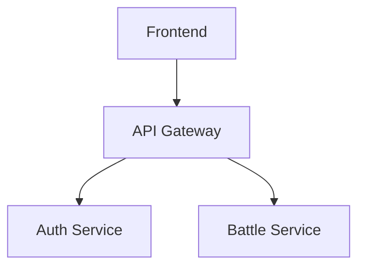

# How to Professionalize Any GitHub Repository

This guide documents the exact process used to transform CodeArena from a dev project into a production-grade, world-class GitHub repository.

## 1. Essential Repository Files

### LICENSE
**Why**: Legal protection, shows project is open-source  
**What**: MIT License (most permissive for public projects)

```bash
# Create LICENSE file with MIT template
# Replace [year] and [fullname] with your details
```

### CODE_OF_CONDUCT.md
**Why**: Shows professionalism, required for GitHub's "Community Standards"  
**What**: Contributor Covenant v2.1 (industry standard)

```markdown
# Contributor Covenant Code of Conduct
## Our Pledge
[Use the official template from contributor-covenant.org]
```

### SECURITY.md
**Why**: Responsible disclosure policy, shows you take security seriously  
**What**: Document supported versions, how to report vulnerabilities, security measures

```markdown
# Security Policy
## Supported Versions
## Reporting a Vulnerability
## Security Measures (list your actual security implementations)
```

---

## 2. GitHub Configuration (.github/)

### Issue Templates
**Location**: `.github/ISSUE_TEMPLATE/`

**bug_report.md**:
```markdown
---
name: Bug Report
about: Report a bug
title: "[BUG] "
labels: bug
---
## Bug Description
## Steps to Reproduce
## Expected vs Actual Behavior
## Environment (OS, Browser, Node version)
```

**feature_request.md**:
```markdown
---
name: Feature Request
about: Suggest a feature
title: "[FEATURE] "
labels: enhancement
---
## Feature Description
## Problem It Solves
## Proposed Solution
```

### Pull Request Template
**Location**: `.github/PULL_REQUEST_TEMPLATE.md`

```markdown
## Description
## Type of Change
- [ ] Bug fix
- [ ] New feature
- [ ] Breaking change
- [ ] Documentation

## Testing
- [ ] Unit tests pass
- [ ] Lint passes
- [ ] Manual testing done

## Checklist
- [ ] Code follows project standards
- [ ] Documentation updated
- [ ] Security reviewed
```

### CI/CD Workflow
**Location**: `.github/workflows/ci.yml`

```yaml
name: CI
on:
  push:
    branches: [main]
  pull_request:
    branches: [main]

jobs:
  lint-and-test:
    runs-on: ubuntu-latest
    steps:
      - uses: actions/checkout@v4
      - uses: actions/setup-node@v4
        with:
          node-version: 20
      - run: npm ci
      - run: npm run lint
      - run: npm run test
      - run: npm run build
```

---

## 3. Documentation Structure

### Root README.md
**Must include**:
1. **Badges** (build status, license, version)
2. **One-line description**
3. **Architecture diagram** (use Mermaid)
4. **Quick start** (3-5 commands to run locally)
5. **Tech stack table**
6. **Link to full docs**

### docs/ Directory Structure
```
docs/
├── README.md                    # Documentation index
├── ARCHITECTURE.md              # System design, data flow
├── CONTRIBUTING.md              # How to contribute
├── CHANGELOG.md                 # Version history
├── getting-started/
│   ├── local-setup.md
│   ├── environment-variables.md
│   └── database-setup.md
├── microservices/               # Per-service docs
├── infrastructure/              # Deployment docs
├── security/                    # Security policies
├── deployment/                  # CI/CD, Docker
├── operations/                  # Troubleshooting
└── api-reference/               # API endpoints
```

### Documentation Best Practices
1. **Write from experience**: Include real errors you encountered
2. **Be specific**: Use actual config values, not placeholders
3. **Add tables**: Resource requirements, port mappings, etc.
4. **Link to code**: Use `file://` links to actual files
5. **Include diagrams**: Architecture, data flow, network policies

---

## 4. Environment Variables

### Never Commit Secrets
**Problem**: `.env` files with real passwords in git history

**Solution**:
1. Create `.env.example` with placeholder values
2. Add `.env` and `.env.*` to `.gitignore`
3. Exception: `!.env.example` in `.gitignore`
4. If secrets already committed: `git rm --cached .env`

```bash
# .gitignore
.env
.env.*
!.env.example
!.env.production.example
```

---

## 5. Docker Best Practices

### Dockerfile Naming
- **Correct**: `Dockerfile` (capital D, no extension)
- **Wrong**: `DockerFile`, `dockerfile`, `Dockerfile.txt`

### Multi-Stage Builds
```dockerfile
FROM node:20-alpine AS builder
WORKDIR /app
COPY package*.json ./
RUN npm ci
COPY . .
RUN npm run build

FROM node:20-alpine AS runner
COPY --from=builder /app/dist ./dist
CMD ["node", "dist/index.js"]
```

### Security
- Run as non-root user (UID 1001)
- Use `dumb-init` for proper signal handling
- Add health checks
- Use `.dockerignore`

---

## 6. Git Hygiene

### Remove Unnecessary Files
**Delete**:
- Learning guides (personal study material)
- Test scripts (`test-*.js`, `create-test-*.ts`)
- Binary lock files (`bun.lockb` if not using Bun)
- Scaffold directories (`.lovable/`, `.vscode/`)
- Build artifacts committed by mistake

```bash
# Remove from tracking but keep locally
git rm --cached file-to-remove

# Remove completely
git rm file-to-remove
```

### .gitignore Essentials
```gitignore
# Dependencies
node_modules/
dist/
coverage/

# Environment
.env
.env.*
!.env.example

# IDEs
.vscode/
.idea/

# OS
.DS_Store
Thumbs.db

# Logs
*.log
logs/
```

---

## 7. Branding & SEO

### index.html
Remove scaffold branding, add proper metadata:

```html
<title>YourProject — One-line Description</title>
<meta name="description" content="Detailed description for SEO" />
<meta name="author" content="Your Name" />
<meta property="og:title" content="YourProject" />
<meta property="og:description" content="Social media preview text" />
```

### robots.txt
```
User-agent: *
Allow: /
Sitemap: https://yourdomain.com/sitemap.xml
```

---

## 8. Commit Message Standards

### Format
```
type(scope): subject

body (optional)

footer (optional)
```

### Types
- `feat`: New feature
- `fix`: Bug fix
- `docs`: Documentation only
- `chore`: Maintenance (dependencies, cleanup)
- `refactor`: Code restructuring
- `perf`: Performance improvement
- `test`: Adding tests

### Examples
```bash
git commit -m "feat(auth): add JWT refresh token rotation"
git commit -m "fix(docker): correct nginx.conf path in frontend build"
git commit -m "chore: remove learning guides and test scripts"
```

---

## 9. Professional Touches

### README Badges
```markdown


```

### Architecture Diagrams
Use Mermaid in markdown:
```markdown

```

### Contributing Guidelines
```markdown
# Contributing

## Development Setup
1. Fork the repo
2. Clone: `git clone ...`
3. Install: `npm install`
4. Run: `npm run dev`

## Pull Request Process
1. Create feature branch
2. Make changes
3. Add tests
4. Run `npm run lint && npm test`
5. Submit PR with description
```

---

## 10. Checklist for Any Project

- [ ] **LICENSE** (MIT recommended)
- [ ] **CODE_OF_CONDUCT.md** (Contributor Covenant)
- [ ] **SECURITY.md** (disclosure policy)
- [ ] **README.md** (badges, quick start, architecture)
- [ ] **CONTRIBUTING.md** (how to contribute)
- [ ] **CHANGELOG.md** (version history)
- [ ] **.github/ISSUE_TEMPLATE/** (bug, feature)
- [ ] **.github/PULL_REQUEST_TEMPLATE.md**
- [ ] **.github/workflows/ci.yml** (lint, test, build)
- [ ] **.env.example** (no secrets)
- [ ] **.gitignore** (comprehensive)
- [ ] **docs/** (structured documentation)
- [ ] Remove scaffold branding from `index.html`
- [ ] Remove learning/test files from git
- [ ] Proper `Dockerfile` naming
- [ ] No secrets in git history
- [ ] Professional commit messages

---

## Tools Used in CodeArena Professionalization

1. **Audit**: `git ls-files`, `find`, `grep` to identify issues
2. **Cleanup**: `git rm --cached`, `rm -rf` for unwanted files
3. **Documentation**: Markdown with tables, Mermaid diagrams, file links
4. **CI/CD**: GitHub Actions with matrix builds
5. **Security**: NetworkPolicies, RBAC, secrets management
6. **Monitoring**: Prometheus, Grafana, Jaeger

---

## Result: World-Class Repository

After applying this guide, your repo will have:
- ✅ Professional appearance (LICENSE, COC, SECURITY)
- ✅ Easy onboarding (README, CONTRIBUTING, .env.example)
- ✅ Automated quality (CI/CD, linting, tests)
- ✅ Structured docs (getting-started, API reference, troubleshooting)
- ✅ Clean git history (no secrets, no junk files)
- ✅ SEO optimized (proper meta tags, sitemap)
- ✅ Community-ready (issue templates, PR template)

**Time investment**: 2-3 hours  
**Impact**: Looks like a senior engineer's portfolio project
