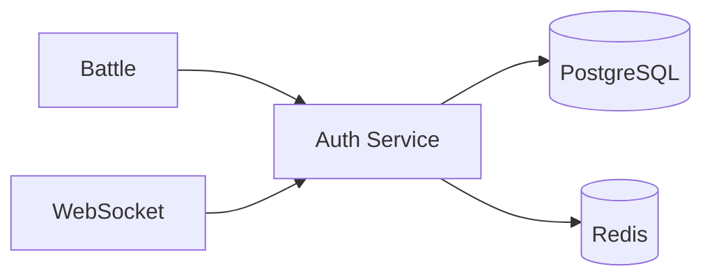

# Auth Service

## Overview

JWT-based authentication microservice handling user registration, login, and token management. All other services call auth-service to validate tokens.

- **Port**: 3001
- **Stack**: Node.js 20 + Express + TypeScript
- **Database**: PostgreSQL (owns `users` table)
- **Cache**: Redis (session tokens)
- **Source**: `backend/services/auth-service/`

## API Endpoints

| Method | Path | Auth | Description |
|--------|------|------|-------------|
| `POST` | `/api/auth/register` | No | Create account |
| `POST` | `/api/auth/login` | No | Login, returns JWT |
| `GET` | `/api/auth/me` | Yes | Get current user profile |
| `GET` | `/api/auth/verify` | Yes | Verify JWT (internal) |
| `GET` | `/health` | No | Health check |
| `GET` | `/metrics` | No | Prometheus metrics |

### POST /api/auth/register
```json
// Request
{
  "username": "player1",
  "email": "player1@example.com",
  "password": "securePassword123"
}

// Response (201)
{
  "token": "eyJhbGciOiJIUzI1NiIs...",
  "user": {
    "id": "uuid",
    "username": "player1",
    "email": "player1@example.com",
    "rating": 1200
  }
}
```

### POST /api/auth/login
```json
// Request
{
  "email": "player1@example.com",
  "password": "securePassword123"
}

// Response (200)
{
  "token": "eyJhbGciOiJIUzI1NiIs...",
  "user": { ... }
}
```

## Environment Variables

See [environment-variables.md](../getting-started/environment-variables.md#auth-service-3001).

## Kubernetes Deployment

- **Replicas**: 2 (min) → 10 (max via HPA at 70% CPU)
- **Resources**: 200m CPU / 256Mi (request), 500m CPU / 512Mi (limit)
- **Health probes**: Liveness + Readiness on `/health:3001`
- **Manifest**: `k8s/base/auth-service.yaml`

## Dependencies



Auth service is a dependency for battle-service and websocket-service (token validation). It has no upstream service dependencies.
