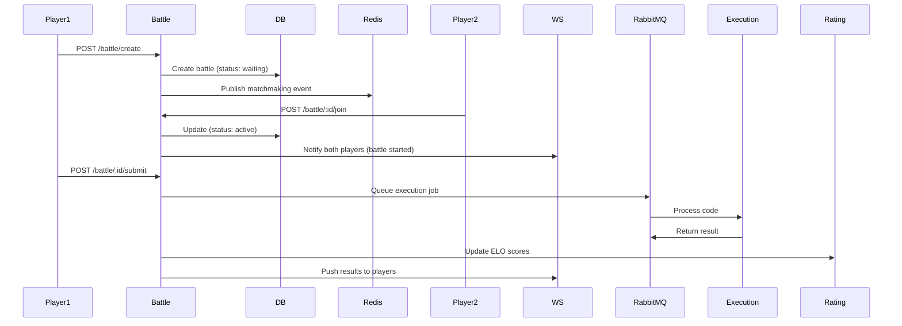

# Battle Service

## Overview

Core game logic service handling battle creation, matchmaking, and game state management. Coordinates between players, execution service, and rating service.

- **Port**: 3002
- **Stack**: Node.js 20 + Express + TypeScript
- **Database**: PostgreSQL (owns `battles`, `battle_participants` tables)
- **Cache**: Redis
- **Queue**: RabbitMQ (publishes execution jobs)
- **Source**: `backend/services/battle-service/`

## API Endpoints

| Method | Path | Auth | Description |
|--------|------|------|-------------|
| `POST` | `/api/battle/create` | Yes | Create a new battle |
| `GET` | `/api/battle/:id` | Yes | Get battle details |
| `GET` | `/api/battle/history` | Yes | User's battle history |
| `POST` | `/api/battle/:id/join` | Yes | Join an existing battle |
| `POST` | `/api/battle/:id/submit` | Yes | Submit code solution |
| `GET` | `/health` | No | Health check |
| `GET` | `/metrics` | No | Prometheus metrics |

### POST /api/battle/create
```json
// Request
{
  "problemId": "two-sum",
  "timeLimit": 300,
  "type": "1v1"
}

// Response (201)
{
  "id": "battle-uuid",
  "status": "waiting",
  "createdBy": "user-uuid",
  "problemId": "two-sum",
  "timeLimit": 300
}
```

### POST /api/battle/:id/submit
```json
// Request
{
  "code": "function twoSum(nums, target) { ... }",
  "language": "javascript"
}

// Response (200)
{
  "submissionId": "sub-uuid",
  "status": "queued"
}
```
The submission is queued via RabbitMQ. Results are pushed back through the WebSocket service.

## Battle Flow



## Kubernetes Deployment

- **Replicas**: 3 (min) → 15 (max via HPA at 70% CPU)
- **Scale-up**: Aggressive — 100% capacity increase every 30s (handles matchmaking spikes)
- **Resources**: 200m CPU / 256Mi (request), 500m CPU / 512Mi (limit)
- **Manifest**: `k8s/base/battle-service.yaml`

## Dependencies

| Dependency | How | Why |
|-----------|-----|-----|
| PostgreSQL | Direct query | Store battles, participants, submissions |
| Redis | Pub/sub | Matchmaking events, cache |
| RabbitMQ | Producer | Queue code execution jobs |
| auth-service | HTTP | Validate JWT tokens |
| execution-service | Via RabbitMQ | Code execution results |
